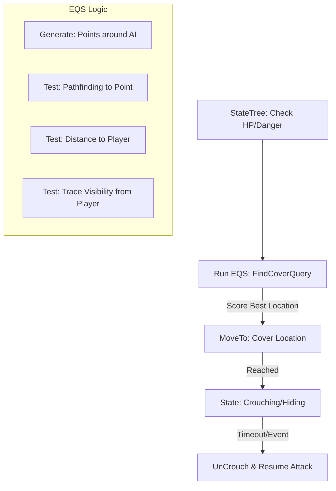
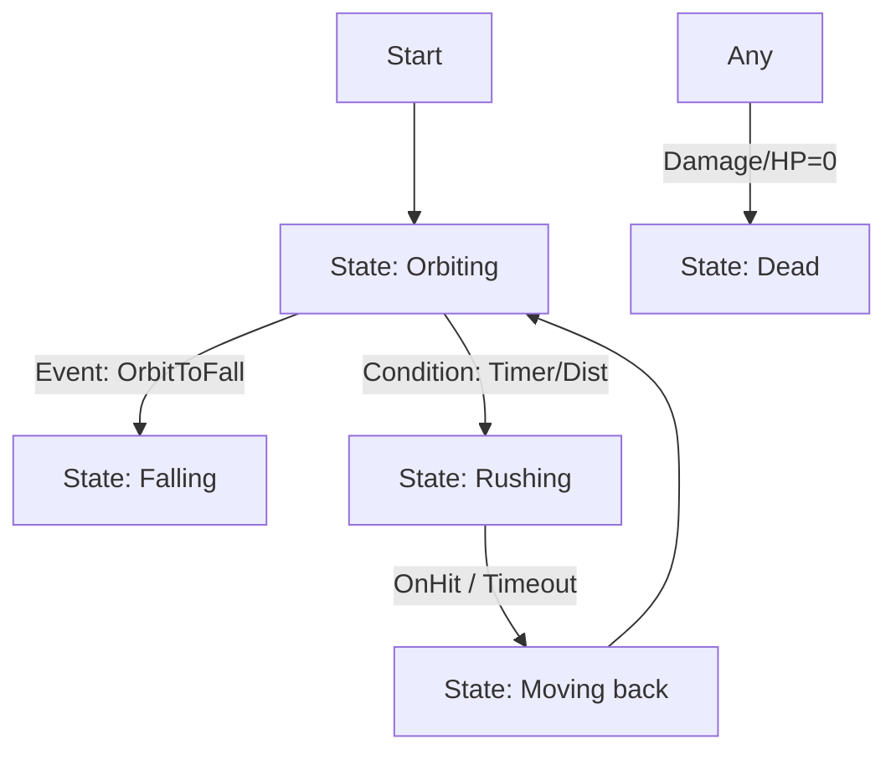
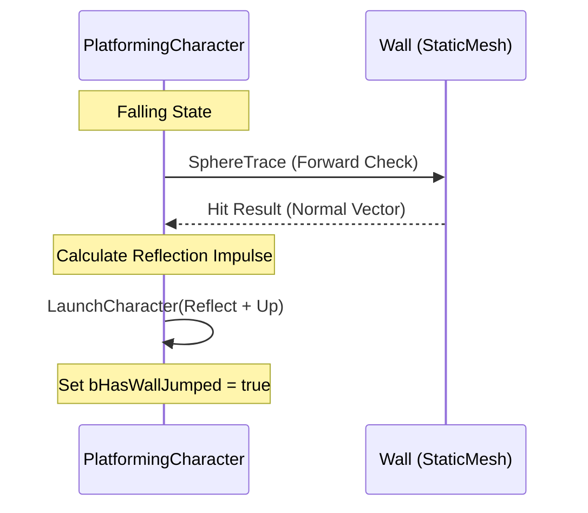
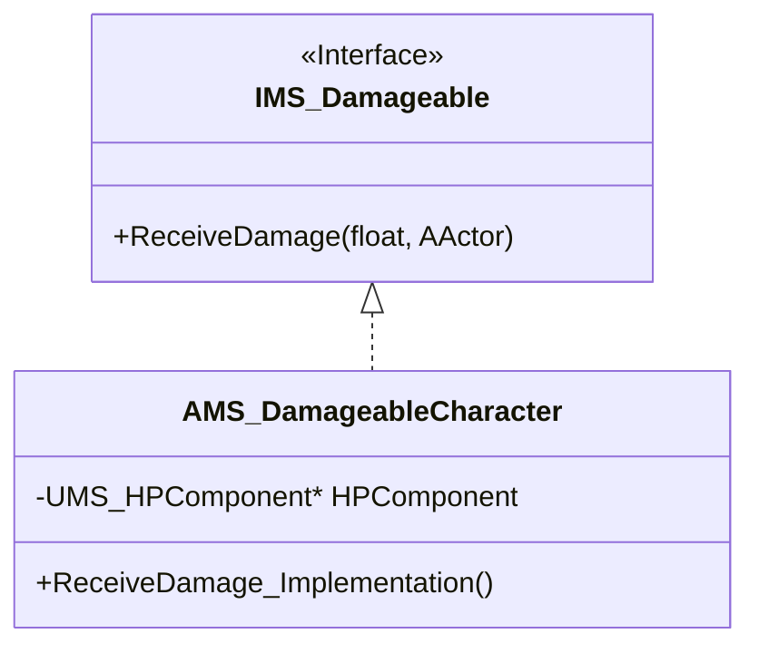

# [Portfolio] Gear Of Three: Multi-Variant Action Framework
> **UE5 StateTree 기반 고성능 AI 및 3가지 액션 장르 통합 프레임워크**

---

## 🚀 프로젝트 개요 (Main Overview)

1. **핵심 컨셉**: 하나의 코어 엔진 하에서 **Combat(3D 액션)**, **Platforming(정밀 이동)**, **SideScrolling(2.5D)**이라는 세 가지 서로 다른 장르의 게임플레이 문법을 통합하고, UE5의 차세대 AI 프레임워크인 **StateTree**와 **EQS**를 심층 활용한 기술 실증형 프로젝트.
2. **개발 환경**: 
    - **Engine**: Unreal Engine 5.3
    - **Language**: C++ (Core Framework), Blueprints (Data Binding)
    - **AI Framework**: StateTree (State-Driven Logic) + **EQS (Environment Query System)**
    - **Input**: Enhanced Input System (Contextual Mapping)
3. **핵심 역할**: 멀티 베리에이션 아키텍처 설계, StateTree 기반 군집 AI 및 전술적 AI 엔진 구현, 인터페이스 기반 데미지 시스템 구축, 고급 물리 이동 컴포넌트 확장.

---

## 🛠 문제 정의 및 해결 전략 (Why & How)

### 1. 문제 정의 (Why)
- **AI의 단조로운 움직임**: 단순히 적을 쫓는 AI는 전술적 깊이가 부족하며, 주변 환경을 인지하여 엄폐물 뒤로 숨는 등의 고도화된 판단 로직이 부재함.
- **장르 간 로직 중첩**: 서로 다른 이동 물리(플랫포머 vs 전투)와 입력 방식이 뒤섞여 코드 복잡도가 급격히 상승하고 확장성이 저하됨.
- **AI 성능 및 가독성**: 기존 Behavior Tree는 다수의 소형 AI를 제어할 때 상태 전이가 직관적이지 않고 런타임 오버헤드가 발생함.

### 2. 해결 전략 (How)
- **EQS 기반 전술적 엄폐 시스템**: **Environment Query System(EQS)**을 활용하여 실시간으로 주변의 최적 엄폐 지점을 탐색. `STT_CoverTarget` 태스크를 통해 엄폐 이동 및 크라우치(Crouch) 상태를 유기적으로 전환.
- **StateTree AI 엔진**: 가볍고 명확한 상태 전이를 보장하는 **StateTree**를 채택. `Orbit(공전) -> Rush(돌진) -> Fall(추락)` 및 `Attack -> Cover` 등의 상태를 정밀 제어.
- **멀티 베리에이션 아키텍처**: 각 장르별 특징을 분리하고, `Enhanced Input`의 Priority 시스템을 통해 모드별 입력 컨텍스트를 동적으로 격리.

### 3. 성과 (Result)
- **전술적 AI 강화**: EQS를 통해 플레이어의 시야로부터 숨거나 엄폐물을 활용하는 지능적인 전투 패턴 구현.
- **유지보수성 증대**: 새로운 모드나 적 타입을 추가할 때 기존 코어 로직의 수정 없이 기능 확장 가능.
- **메모리 최적화**: StateTree와 비트 필드 상태 관리를 통해 대규모 개체 운용 시에도 고성능 유지.

---

## 💎 핵심 기술 상세 (Technical Deep Dive)

### 1. EQS 기반 전술적 엄폐 시스템 (`STT_CoverTarget`)
- **개요**: 환경을 분석하여 최적의 생존 위치를 찾아 이동하는 전술 AI 모듈.
- **설계 의도**: 단순한 추격 AI를 넘어 플레이어와 상호작용하는 느낌을 주기 위해 **환경 인지 능력(Environmental Awareness)**을 부여.

- **핵심 기술**:
    - **Dynamic Querying**: 실시간으로 변화하는 전장 상황을 `UEnvQuery`로 분석하여 최적의 가중치를 가진 지점으로 이동.
    - **State Integrity**: `ExitState` 라이프사이클을 활용하여 상태 전이 시 `UnCrouch`를 보장하는 등 리소스 해제 및 상태 무결성 확보.

### 2. StateTree 기반의 차세대 군집 AI (`ALeech`)
- **개요**: 수십 마리의 개체가 플레이어를 공전하며 유기적인 공격 패턴을 형성하는 AI 시스템.

- **핵심 기술**:
    - **OrbitPlaneQuat**: 쿼터니언을 활용한 궤도 계산으로 물리 충돌 시에도 떨림 없는 부드러운 공전 구현.
    - **Event-Driven Transition**: Gameplay Tag를 트리거로 사용하여 C++ 로직과 StateTree 에셋 간의 비동기 통신 최적화.

### 3. 고밀도 플랫포머 물리 시스템 (`PlatformingCharacter`)
- **개요**: 벽 점프, 대시, 코요테 타임 등 정밀한 조작감을 요구하는 액션 이동 시스템.

### 4. 인터페이스 중심의 확장형 프레임워크 (`IMS_Damageable`)
- **개요**: 시스템 간의 결합도를 최소화한 데미지 및 체력 관리 컴포넌트.

---

## 📝 회고 (Retrospective)

본 프로젝트를 통해 UE5의 **StateTree**와 **EQS**를 결합하여 **'생동감 있는 AI'**를 설계하는 기술적 자신감을 얻었습니다. 특히 환경 쿼리를 통해 AI가 단순히 코드에 정의된 대로 움직이는 것이 아니라, 플레이어의 위치와 전장의 지형지물을 스스로 판단하여 대응하게 함으로써 게임플레이의 깊이를 한 단계 높일 수 있었습니다. 

또한, 복잡한 상태 전이 중에도 데이터 무결성을 유지하기 위해 `ExitState` 등의 라이프사이클을 엄격히 관리하는 법을 익혔으며, 이는 대규모 액션 게임 개발에 필수적인 역량임을 깨달았습니다.
