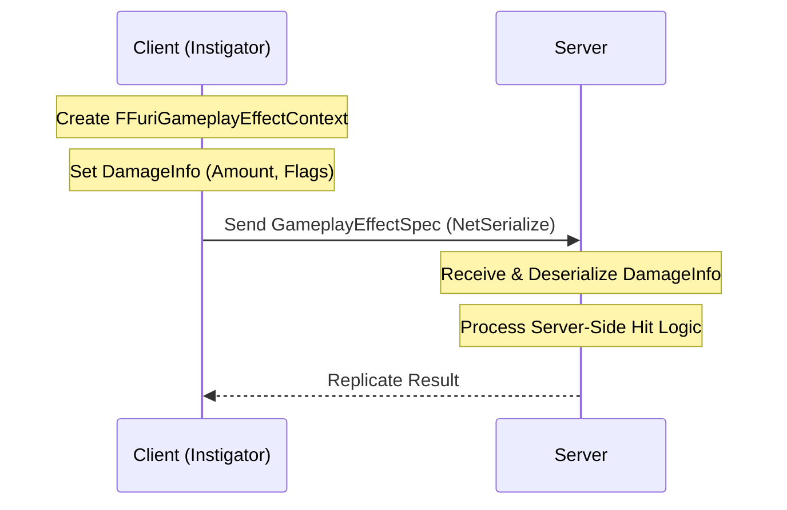
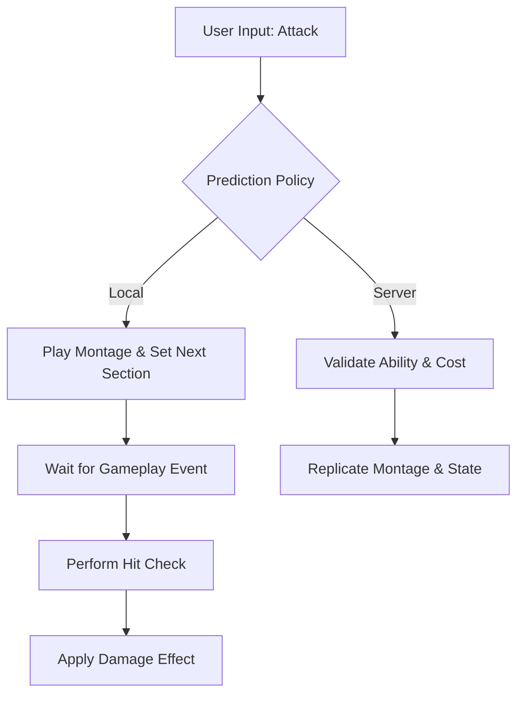
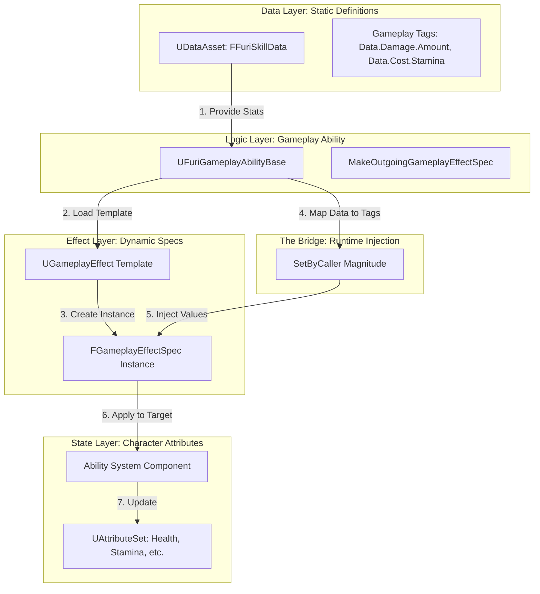
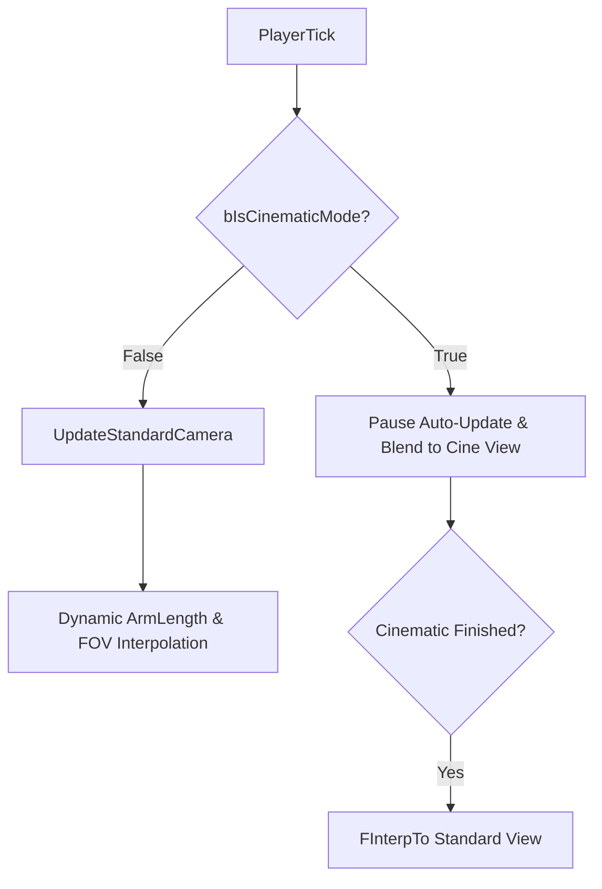

# 🚀 기술 포트폴리오 정리 전문 프롬프트 (Unreal Engine 5)

## [역할 설정]
너는 Unreal Engine 5 전문 기술 포트폴리오 컨설턴트야. 내가 제공하는 프로젝트 데이터를 바탕으로, 채용 담당자가 매력을 느낄 수 있도록 **'데이터 주도 설계', '객체 지향 원칙(SOLID)', '멀티플레이어 최적화'** 관점에서 내용을 정리해줘. 모든 문장은 핵심 위주로 간결하게 작성하고, 기술 전문 용어를 적극적으로 활용해줘.
너는 여태까지 프로젝트의 커밋기록과 파일 변경내역을 읽고 아래의 내용을 작성해야해
---

## [구조 1: 메인 프로젝트 개요 페이지]
다음 항목에 맞춰 내용을 정리해줘:

1. **프로젝트 개요**: 프로젝트의 핵심 컨셉과 개발 환경(UE 버전, 인원, 기간, 역할).
2. **문제 정의 (Why)**: 기존 구조의 한계점이나 개발 중 직면한 기술적 난제.
3. **해결 전략 (How)**: 문제를 해결하기 위해 도입한 설계 아키텍처나 기술적 접근법.
4. **성과 (Result)**: 시스템 도입 후 얻은 정량적/정성적 이득 (성능 향상, 유지보수성 증대 등).
5. **회고 (Retrospective)**: 프로젝트를 통해 얻은 기술적 인사이트와 성장 포인트.

---

## [구조 2: 기술 다이어그램 상세 페이지 (기능별 반복)]
각 주요 시스템(예: 전투, 인벤토리, 네트워크 등)별로 다음 항목을 정리해줘:

1. **개요**: 해당 시스템의 역할과 동작 원리.
2. **설계 의도**: 왜 이 구조(예: Component 기반, Interface 활용 등)를 선택했는지에 대한 논리적 근거.
3. **핵심 성과**
4. **해당 시스템에 대한 Mermaid Diagram 작성**
---

## [참고할 포트폴리오 스타일]
- **논리적 서사**: "현상 인식 -> 원인 분석 -> 해결책 제시 -> 성과 증명"의 흐름을 따를 것.
- **기술적 깊이**: 단순 구현보다는 '왜 이 엔진 기능을 사용했는지'와 '어떤 설계 원칙(OCP, SRP 등)을 준수했는지'를 명시할 것.
- **시각화 연동**: 다이어그램의 흐름(Flow)과 텍스트 설명이 유기적으로 연결되도록 할 것.

아래는 예시 내용임

# [Portfolio] Furi Replicant: Networked High-Speed Action
> **UE5 GAS 기반의 고밀도 전투 시스템 및 커스텀 데이터 파이프라인 구축**

---

## 🚀 프로젝트 개요 (Main Overview)

1. **핵심 컨셉**: 하드코어 액션 게임 'Furi'의 핵심 시스템을 모작하며, 고속 액션에 최적화된 전투 메커니즘과 실시간 네트워크 동기화를 구현한 프로젝트.
2. **개발 환경**: 
    - **Engine**: Unreal Engine 5.3
    - **Language**: C++ (Core), Blueprints (UI/VFX)
    - **Framework**: Gameplay Ability System (GAS)
    - **Networking**: Client-Server (Prediction & Custom Serialization)
3. **핵심 역할**: 고성능 액션 구현을 위한 GAS 프레임워크 확장, 네트워크 예측 기반 전투 시스템 설계, 데이터 주도형 아키텍처 구축.

---

## 🛠 문제 정의 및 해결 전략 (Why & How)

### 1. 문제 정의 (Why)
- **네트워크 데이터 유실**: GAS의 기본 컨텍스트가 프로젝트 고유의 데미지 데이터(`FFuriDamageInfo`)를 직렬화하지 못해 클라이언트-서버 간 판정 불일치 발생.
- **반응성 저하**: 네트워크 지연 발생 시 애니메이션이 멈추거나 콤보 입력이 씹히는 현상으로 인해 고속 액션의 조작감 훼손.
- **시스템 간 결합도**: 카메라 로직과 시네마틱 연출 로직이 강하게 결합되어 필살기 연출 중 화면 흔들림 발생.

### 2. 해결 전략 (How)
- **GAS 파이프라인 확장**: `FGameplayEffectContext`를 오버라이딩하여 커스텀 직렬화(`NetSerialize`) 로직을 직접 구현, 데이터 무결성 100% 확보.
- **예측 정책 적용**: `LocalPredicted` 정책과 `MontageSetNextSectionName`을 결합하여 지연 시간 중에도 클라이언트 사이드에서 즉각적인 피드백 제공.
- **상태 기반 제어**: `bIsCinematicMode` 상태 플래그를 도입하여 시스템 간 실행 로직을 물리적으로 격리(Decoupling).

### 3. 성과 (Result)
- **유지보수성 증대**: `DataAsset` 기반 설계로 기획 데이터 수정 시 코드 재빌드 없이 실시간 밸런싱 가능.
- **네트워크 최적화**: 비트 단위 직렬화를 통해 패킷 크기를 최소화하고 판정 오차 제거.
- **시각적 완성도**: 상태 관리를 통한 안정적인 시네마틱 뷰 전환으로 연출 퀄리티 향상.

---

## 💎 핵심 기술 상세 (Technical Deep Dive)

### 1. 커스텀 GAS 파이프라인 및 직렬화
- **개요**: 엔진 레벨의 GAS 컨텍스트를 확장하여 게임 고유의 데미지 판정 데이터를 네트워크 상에서 안전하게 전달하는 시스템.
- **설계 의도**: 단순 수치 전달을 넘어 패링 가능 여부, 가드 관통 등 복합적인 속성을 네트워크 패킷 수준에서 보장하기 위함.

- **핵심 성과**:
    - **네트워크 최적화**: `FArchive`를 활용한 선택적 직렬화로 불필요한 데이터 전송 차단.
    - **데이터 확장성**: `FFuriDamageInfo` 구조체 수정을 통해 새로운 공격 속성을 손쉽게 추가 가능.

### 2. 로컬 예측 기반 고속 콤보 시스템
- **개요**: 서버의 응답을 기다리지 않고 클라이언트에서 즉시 액션을 실행한 뒤 서버와 동기화하는 고성능 연격 시스템.
- **설계 의도**: 0.1초의 지연도 용납되지 않는 하드코어 액션 게임의 특성을 고려하여 **Local Predicted** 정책을 최우선으로 채택.

- **핵심 성과**:
    - **반응성 확보**: 지연 시간(Ping) 100ms 환경에서도 끊김 없는 매끄러운 콤보 연계 달성.
    - **결합도 해소**: 애니메이션 몽타주와 GAS 태스크를 유기적으로 연결하여 코드 복잡도 감소.

### 3. 데이터 주도형(Data-Driven) 스킬 아키텍처
- **개요**: 모든 어빌리티의 수치(데미지, 코스트, 쿨타임)를 외부 데이터 에셋에서 동적으로 주입받는 구조.
- **설계 의도**: **OCP(개방-폐쇄 원칙)**를 준수하여, 로직 수정 없이 데이터만으로 새로운 스킬을 구성. `SetByCaller` 방식을 통해 고정된 GE 블루프린트의 한계를 극복하고 유연한 수치 제어 환경 구축.

- **핵심 성과**:
    - **생산성 향상**: 기획자가 엔진 에디터 상에서 직접 전투 밸런스를 조정할 수 있는 워크플로우 구축.
    - **유연성**: 동일한 `GameplayEffect` 클래스를 공유하면서도, 스킬 에셋에 따라 서로 다른 수치와 성격을 부여 가능.

### 4. 상태 기반 카메라 시스템 제어
- **개요**: 전투 중 거리 기반 자동 줌인/아웃 로직과 필살기 시네마틱 연출 간의 충돌을 방지하기 위한 상태 관리 시스템.

---

## 📝 회고 (Retrospective)

본 프로젝트를 통해 단순히 기능을 구현하는 것을 넘어, **'엔진의 기본 프레임워크를 프로젝트의 목적에 맞게 확장하는 법'**을 깊이 있게 배웠습니다. 특히 네트워크 환경에서의 데이터 무결성과 조작 반응성 사이의 균형을 맞추는 과정에서 **커스텀 직렬화 및 예측 기술**의 중요성을 체감했습니다. 향후 대규모 멀티플레이어 환경에서도 안정적으로 동작하는 고성능 시스템을 설계할 수 있는 기술적 자신감을 얻었습니다.

---